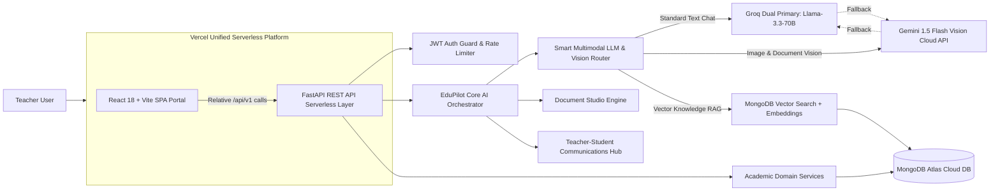
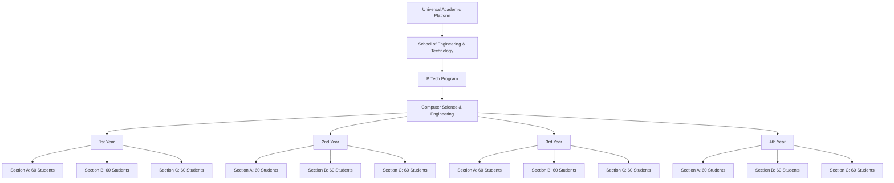
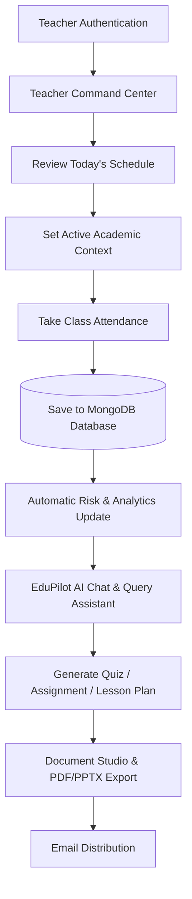

<!-- markdownlint-disable -->
<div align="center">

<p align="center">
  
</p>

<p align="center">
  
</p>

---

</div>

> 🎓 Universal AI Academic Operating System — Complete Technical Architecture Document

---

## 🚀 High-Level System Architecture

### Cloud Topology: Unified Vercel Platform & External Services



---

## 🤖 Smart Model Router Execution Flow

EduPilot AI uses an automated task-based routing pipeline to deliver ultra-fast responses and multimodal image comprehension:

| Input Type | Primary Model | Fallback Model | Capabilities |
| :--- | :--- | :--- | :--- |
| **Standard Text Chat** | **Groq Llama-3.3-70B** | Gemini 1.5 Flash | Sub-second response speed, curriculum Q&A, lesson planning |
| **Image / Document Upload** | **Gemini 1.5 Flash Vision** | Groq Llama-3.3-70B | Visual comprehension of handwriting, diagrams, equations, and textbook screenshots |
| **RAG Vector Search** | **MongoDB Vector Engine** | Local Keyword RAG | Custom institutional syllabus and uploaded PDF knowledge retrieval |

```
Standard Chat  ─────► Groq Llama-3.3-70B (Primary) ──► Fast 0.5s Text Answer
Image Upload   ─────► Gemini 1.5 Flash Vision      ──► Visual Comprehension & Answer
API Key Unset  ─────► EduPilot Local Smart Engine   ──► Fallback Contextual Response
```

---

## 🗄️ Database Architecture & Collection Schema Map

EduPilot AI relies on MongoDB Atlas for data persistence, storing academic entities, vector embeddings, and persistent RAG documents:

| Collection Name | Purpose | Key Fields |
| :--- | :--- | :--- |
| `teachers` | Faculty user accounts & credentials | `id`, `faculty_id`, `email`, `hashed_password`, `full_name`, `avatar_url`, `is_demo` |
| `students` | 720 canonical student profiles | `id`, `roll_number`, `first_name`, `last_name`, `email`, `year_id`, `section_id` |
| `courses` | Academic course catalog | `id`, `code`, `name`, `credits`, `department_id` |
| `classes` | Active teacher class mappings | `id`, `teacher_id`, `course_id`, `year_label`, `section_name` |
| `attendance_sessions` | Daily attendance session entries | `id`, `class_id`, `date`, `submitted_by`, `status` |
| `attendance_records` | Per-student attendance status | `id`, `session_id`, `student_id`, `status` (`present`/`absent`) |
| `rag_documents` | Uploaded Knowledge Base files | `id`, `teacher_id`, `filename`, `file_type`, `image_b64`, `extracted_text`, `status` |
| `rag_chunks` | Embedded vector text chunks | `id`, `document_id`, `teacher_id`, `content`, `embedding` (vector array) |
| `assignments` | AI-generated coursework | `id`, `class_id`, `title`, `topic`, `difficulty`, `questions` |
| `assessments` | MCQ quizzes & exam papers | `id`, `class_id`, `title`, `subject`, `total_marks`, `questions_data` |
| `daily_notes` | Daily lecture discussion logs | `id`, `class_id`, `topic`, `summary_markdown`, `key_takeaways` |
| `communications` | Sent teacher email logs | `id`, `class_id`, `subject`, `body`, `recipient_type`, `sent_at` |

---

## 🎨 Asset Optimization & Client Compression Engine

To deliver maximum performance and eliminate server payload errors on serverless environments:

1. **Static WebP Asset Layer**: All frontend images (`hero_illustration.webp`, `login_hero_illustration.webp`, `brand_logo.webp`) are served as WebP binaries from `frontend/public/images/`.
2. **Client-Side Canvas Compression**: When teachers upload profile avatars in `ProfilePage.tsx`, an in-browser HTML5 `<canvas>` resizes photos to `400x400` JPEG (~30KB), preventing `HTTP 413 Payload Too Large` errors on Vercel serverless endpoints.
3. **Skeleton Page Loading UX**: Pages render `<SkeletonPageLoader />` instantly on navigation while data fetches asynchronously.

---

## 👥 Academic Hierarchy & Student Placement



---

## ⏱️ Teacher Daily Journey & Workflow



---

<p align="center">
  
</p>
