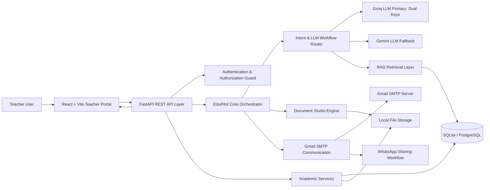
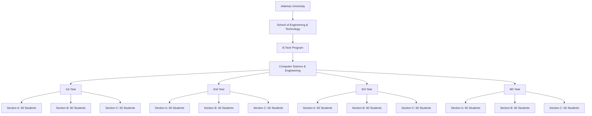
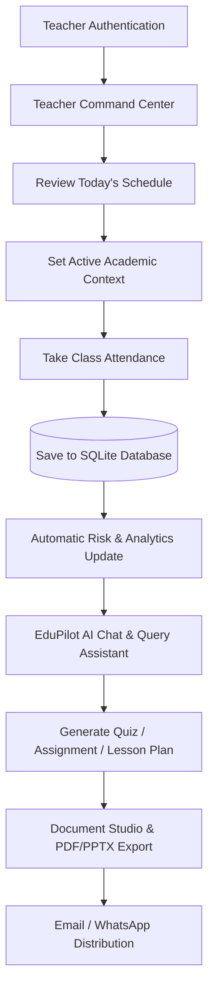

# 🎓 EduPilot AI — System Architecture & Workflow Specifications

> AI Academic Operating System tailored for Adamas University

---

## 🚀 High-Level System Architecture

---

## 🏛️ Academic Hierarchy & Student Placement

---

## 🔄 Teacher Daily Journey & Workflow

